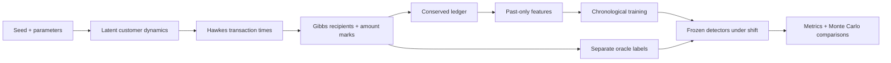

<div align="center">

# FluxFraud
### A physics-led laboratory for fraud detection under distribution shift

**Stochastic processes · Temporal networks · Monte Carlo experiments · Machine learning**

[Start here](#run-an-experiment) · [Mathematical model](#the-mathematical-model) · [Experimental protocol](#experimental-protocol) · [Literature](docs/LITERATURE.md) · [Usage guide](HOW_TO_USE.txt)

</div>

> Construct a stochastic financial environment with known ground truth, investigate how customer behaviour and fraud evolve, and use statistical and machine-learning methods to test what remains detectable when the environment changes.

FluxFraud makes the simulator the scientific object and the detector an experimental instrument. Bursty activity, spending fluctuations, recipient preferences and changing attack behaviour jointly generate the data. Feature and mechanism ablations make it possible to ask **why** a detector succeeds, rather than merely report a high score on a fixed CSV.

This is an independent research portfolio project. It uses no customer data and is not affiliated with Revolut. Its mechanisms are plausible hypotheses, **not an empirically calibrated model of a bank**. Synthetic performance is not evidence of production performance.

## What is implemented

| Layer | Mechanism | Scientific purpose |
|---|---|---|
| Event timing | Continuous-time exponential Hawkes arrivals; hourly background rates | Separate endogenous bursts from daily seasonality |
| Customer dynamics | Three-state Markov behaviour and exact Ornstein–Uhlenbeck transitions | Model persistence, relaxation and correlated spending |
| Transfers | Gibbs recipient probabilities on a directed graph with memory | Relate exploration, concentration and network history |
| Fraud | Hidden compromise/recovery, overlapping transaction marks, concentrated destinations | Generate known labels without an observable fraud flag |
| Shift | Scheduled change to ordinary spending, compromise hazard and fraud camouflage | Stress a detector trained on an earlier environment |
| Accounting | Integer minor-unit balances and rejected insufficient-funds attempts | Preserve money and distinguish attempts from settled value |
| Detection | Behaviour rule, logistic regression, isolation forest and gradient boosting | Compare transparent, unsupervised and nonlinear methods |
| Experiment | Chronological splits, delayed labels, ablations and independent simulation seeds | Avoid future leakage and quantify simulation uncertainty |
| Delivery | Python package, CLI, Streamlit workbench, SQLite, tests and CI | Make the experiment reproducible and inspectable |



## Run an experiment

Python 3.11 or newer is required. From the repository root:

```bash
python3 -m venv .venv
source .venv/bin/activate
python -m pip install -e '.[app,dev]'
fluxfraud run --config configs/default.json --out runs/demo
streamlit run app.py
```

On Windows, activate with `.venv\Scripts\activate`. Open the local address printed by Streamlit. Use a **new output directory** for each CLI run; existing outputs are never silently overwritten.

The app exposes seed, population, duration, branching ratio, network temperature, shift strength and review capacity. It shows transaction dynamics, hidden-state diagnostics, precision–recall curves, a time-filtered network and downloadable data. Changing controls only affects results after pressing **Run experiment**; the displayed configuration identifies the actual run.

```bash
# Five independent worlds × four mechanism settings × six detector variants
fluxfraud monte-carlo --config configs/default.json --seeds 11 22 33 44 55 --out runs/mc

# Mathematical, causality, accounting and integration checks
pytest -q
ruff check .

# Retrospective SQL analysis; sqlite3 CLI must be installed separately
sqlite3 -header -column runs/demo/transactions.sqlite < sql/analysis.sql
```

A run exports `config.json`, `manifest.json`, `transactions.sqlite`, `metrics.csv` and `policies.json`. The manifest records package versions and a SHA-256 digest of the generated transaction table. Exact reproducibility requires matching dependencies as well as seed and configuration; `requirements-lock.txt` records the tested environment. Its pins may need updating for other Python/platform combinations.

## The mathematical model

Time is measured in **hours**, amounts in **integer minor units**, and all rates are per hour. Customers exchange transfers inside a closed population. The simulation starts without event or network history; this deliberate cold start is not a stationary sample.

### 1. Heterogeneous activity and daily rhythm

Customer activity follows

$$a_i\sim\operatorname{LogNormal}(-s_a^2/2,s_a^2),\qquad s_a=0.55,$$

so $\mathbb E[a_i]=1$. The background arrival intensity during hour $h$ is

$$\mu_i(h)=\mu_0a_i\left[1+0.55\cos\left(\frac{2\pi(h\bmod24-15)}{24}\right)\right]b_{S_i(h)}c_i(h).$$

Here $b=(1,1.4,1.8)$ for ordinary, travelling and high-spend states. The multiplier $c_i$ is one normally and $3/(1+0.5d)$ when compromised, where $d$ is the active shift strength. The hourly transition matrix is

$$P=\begin{pmatrix}0.990&0.006&0.004\\0.035&0.960&0.005\\0.080&0.010&0.910\end{pmatrix}.$$

A discrete-time transition updates the state at each hour boundary. These states create legitimate anomalies, so an unusual transaction need not be fraud.

### 2. Self-excitation and relaxation

Within each constant-background interval,

$$\lambda_i(t)=\mu_i(h)+\sum_{t_k^i<t}\eta\beta e^{-\beta(t-t_k^i)}.$$

The integrated kernel is $\eta$, the expected offspring count in the branching interpretation. For a constant background and stationary history, $\mathbb E[\lambda_i]=\mu_i/(1-\eta)$ when $\eta<1$. This is a reference limit, not the mean of the full nonstationary simulator. We enforce $0\le\eta<0.95$ and use thinning with decaying upper bounds, carrying excitation across hour boundaries. No arbitrary intensity clipping is used. A safety limit aborts excessive simulations. See [Bacry et al.](https://arxiv.org/abs/1502.04592), Sections 2 and Appendix B.

### 3. Spending as a stochastic dynamical system

The latent log-spending state obeys

$$dX_i=\kappa(m_i(h)-X_i)\,dt+\sigma\,dW_i.$$

The target is $m_i(h)=m_i^0+u_{S_i(h)}+0.2d$, with $m_i^0\sim\mathcal N(\log45,0.65^2)$ and $u=(0,0.25,0.65)$. With $m_i$ held fixed for an hour, the exact transition is

$$X_i(h+\Delta)=m_i+(X_i(h)-m_i)e^{-\kappa\Delta}+\sigma\sqrt{\frac{1-e^{-2\kappa\Delta}}{2\kappa}}Z,\quad Z\sim\mathcal N(0,1).$$

The implementation draws this hourly state before the hour's events and holds it fixed within that hour. This is an hourly latent environment, not continuous OU interpolation at every event. Conditional amounts are

$$A_i=\max\left(1,\operatorname{round}\left[100f_y(d)e^{X_i+0.6\epsilon}\right]\right),\quad\epsilon\sim\mathcal N(0,1),$$

where $f_0=1$ and $f_1(d)=2.8/(1+1.4d)$. Both classes have overlapping support. Stationary OU variance is $\sigma^2/(2\kappa)$ for a fixed target; relaxation time is $1/\kappa$. These quantities give parameters a physical interpretation.

### 4. A statistical-mechanics-inspired transfer network

Each account has one of four synthetic communities. For $j\ne i$, define

$$E_{ij}(t)=1.4\mathbf1[g_i\ne g_j]-w\log(1+n_{ij}(t^-))-\frac{3.5y}{1+d}\mathbf1[j\in R].$$

Then sample a recipient from

$$p_{ij}(t)=\frac{e^{-E_{ij}(t)/T}}{\sum_{k\ne i}e^{-E_{ik}(t)/T}}.$$

$T$ controls exploration; $w$ controls reinforcement of earlier counterparties; $R$ is a hidden recipient ring. We subtract the minimum energy before exponentiating for numerical stability. At high temperature preferences flatten; at low temperature minimum-energy choices dominate. This is a generative choice rule, **not a claim that customers are in thermodynamic equilibrium**. Network memory counts attempts, including declined ones.

Activity-driven network research motivates retaining edge timing instead of treating the final graph as available from the start. Our recipient memory and communities extend beyond the memoryless model of [Perra et al.](https://pmc.ncbi.nlm.nih.gov/articles/PMC3384079/).

### 5. Hidden compromise and controlled distribution shift

At each hourly step, an uncompromised account switches with probability $1-e^{-q(1+d)}$; a compromised account recovers with probability $1-e^{-r}$. This is a discrete-time two-state chain using hazard-derived transition probabilities, not an exact continuous-time two-state transition matrix. Simultaneous recovery and reinfection within one hour are excluded. At an event from a compromised account, $y\sim\mathrm{Bernoulli}(0.65)$; otherwise $y=0$.

The default intervention starts at $0.75H$. It increases compromise frequency and legitimate spending while reducing fraud's amount, device, foreign-transfer and destination-concentration signatures. It is a **joint distribution intervention**: it is not a clean isolated estimate of covariate shift, prior shift or conditional shift. Separate interventions would be needed to identify their individual effects.

The `mule_transfer` tag means a fraudulent event originated from an account in the hidden ring. There is no explicit multihop laundering scheduler or conservation of criminal provenance; do not interpret this tag as a full AML simulator. Takeover and ring tags remain oracle metadata and never enter model inputs.

### 6. Accounting invariants

For accepted transfer $(i,j,A)$:

$$B_i' = B_i-A,\qquad B_j'=B_j+A,\qquad\sum_iB_i'=\sum_iB_i.$$

If $B_i<A$, the attempt is declined and balances are unchanged. Negative balances and self-transfers are prohibited. Accounts start with 2,000–8,000 units; there are no deposits, wages, FX conversions, merchant settlement or credit lines. Attempts drive event and graph histories whether accepted or declined. Detection is evaluated on attempts; captured monetary value uses **settled fraudulent amounts only**, and is an analysis proxy rather than realised prevented loss.

## Experimental protocol

### Information available at decision time

Features are computed before the current event is inserted into history. The current amount, device indicator, foreign indicator, time and pre-transfer balance are observable. Historical features include trailing counts, an expanding log-amount z-score, elapsed time, prior pair count, distinct prior senders to the recipient and outgoing-counterparty entropy:

$$S_i=-\sum_jp_{ij}\log p_{ij},\qquad p_{ij}=n_{ij}/\sum_kn_{ik}.$$

Entropy is updated incrementally using $\sum_j n_{ij}\log n_{ij}$. The detector never receives account IDs, hidden states, ring membership, ground-truth typology, labels, acceptance outcomes or the final graph. Prefix-invariance tests check that appending future events cannot alter earlier features.

### Training, policy selection and testing

| Phase | Event times | Labels available by |
|---|---|---|
| Train | $t<0.5H$ | $0.5H$ |
| Validation | $0.5H\le t<0.7H$ | $0.7H$ |
| Test | $t\ge0.7H$ | Oracle used retrospectively for scoring only |

Labels mature after a configurable fixed delay. Immature examples are excluded from training and validation, while their observable transactions can still update history. Scaling is fitted only on training data. The models remain frozen throughout the test period, allowing a clean robustness stress test. This does not implement online retraining or investigator-selection feedback. Delayed supervision and limited review capacity are motivated by [Dal Pozzolo et al.](https://boracchi.faculty.polimi.it/docs/2015_04_Credit_Card_Fraud_Detection_DalPozzolo_Boracchi_Caelen_Alippi_Bontempi.pdf).

Thresholds are chosen from validation score quantiles to approximate a daily review budget. They are never tuned on test labels. Tied scores and drift can change the realised alert rate. A second policy ranks each calendar day's test transactions and selects at most $K$; this is **retrospective daily batch triage**, not a causal real-time capacity guarantee. Selection happens once over the test set; pre/post-shift slices share that selection even when the shift divides a day. Partial days still receive a full budget.

### Metrics and comparisons

We report average precision (the step-weighted AP definition, not trapezoidal PR area), ROC AUC, threshold precision/recall, alert rate, daily-budget precision/recall, settled-fraud value capture, and Brier score for supervised probabilities. Average precision is undefined when there are no positive examples; ROC AUC is undefined with either class absent. Missing values are recorded rather than disguised as success.

Precision depends on prevalence; therefore every slice reports prevalence and fraud counts. ROC AUC remains useful as a ranking summary, but does not by itself specify review workload. See [Saito & Rehmsmeier](https://doi.org/10.1371/journal.pone.0118432).

The supervised probabilities are not post-hoc calibrated. Isolation Forest is fitted to the unlabelled training mixture, not an oracle-clean normal subset; its anomaly scores are not probabilities.

Two types of ablation answer different questions:

- **Feature ablations:** full boosting versus static-only and no-network boosting, on the same realised data.
- **Mechanism interventions:** no excitation, no recipient-memory reinforcement and no shift, each with independently rerun simulations. Removing memory retains community/ring preferences; it does not remove the entire network.

Monte Carlo results aggregate independent seeds, with a Student-$t$ interval for the mean across seeds. These are intervals over simulator randomness, not real-population uncertainty. Five seeds are a small pilot, and intervals can extend outside [0,1]; they are intentionally not clipped. Larger studies should use more seeds, parameter sweeps and held-out generative mechanisms. Same-seed scenarios share some latent random draws but do not guarantee event-level counterfactual alignment.

## Results and scientific limits

A checked-in reference run and a [five-seed, four-scenario study](reports/RESULTS.md) are included. In the full simulator, mean all-test average precision was 0.161 for logistic regression, 0.149 for the behaviour rule and 0.134 for boosting. All detector variants deteriorated after the joint shift; the study did not establish a reliable benefit from adding network features. These are pilot findings, with wide uncertainty intervals. Results must be interpreted against the exact configuration, fraud prevalence and intervention. An ordinary behaviour rule can outperform ML under shift; a physics-led project should expose that result rather than hide it.

The simulation is deliberately compact: diagonal self-excitation rather than a multivariate Hawkes network; four fixed communities; a static hidden ring; fixed label delay; a single scheduled shift; no policy feedback on customer or attacker behaviour. Network statistics grow from a cold start. There is no empirical calibration, fairness audit, adversarial optimisation, parameter inference, production serving or claim of regulatory suitability.

A valuable next research stage is calibration against non-sensitive aggregate statistics, then held-out mechanisms and sensitivity analysis across timescales, network temperature, rarity and delay. Hawkes likelihood fitting and time-rescaling residual diagnostics would test process recovery; they are not implemented here. The statistical-mechanics interpretation supplies a tractable model and measurable hypotheses, not evidence that a financial system obeys a physical law.

## Repository map

```text
app.py                       Interactive experiment workbench
configs/default.json         All exposed simulation parameters
src/fluxfraud/
  config.py                  Validation and configuration
  processes.py               OU, Hawkes, Gibbs primitives
  simulator.py               Customer states, events, marks, ledger
  features.py                Past-only temporal and graph features
  evaluation.py              Splits, detectors, thresholds, metrics
  experiments.py             Monte Carlo and mechanism interventions
  storage.py                 SQLite and reproducibility manifests
  cli.py                     Command-line workflow
sql/analysis.sql             Time, flow and causal-window examples
tests/                       Mathematical and system checks
docs/LITERATURE.md           Critical reading and design traceability
reports/                     Measured reference results
HOW_TO_USE.txt               Setup, parameter meanings and troubleshooting
```

The dense recipient-choice representation costs $O(N^2)$ memory and $O(EN)$ recipient work for $N$ accounts and $E$ events. This is a research-scale simulator, not a millions-of-accounts engine. Online history features use deques and incremental moments; computation avoids full future graph construction. Each experiment uses bounded model threading to avoid small-run oversubscription.

## Portfolio narrative

“My physics background shapes how I approach financial data science: I construct an interpretable stochastic system, derive its limiting behaviour, verify its conservation and causality properties, and design controlled experiments. I then use SQL, statistics and machine learning to investigate which observable signals remain useful as customer and fraud behaviour evolve.”

Use measured findings from your own runs to support this narrative. The strongest interview discussion is about assumptions, failed detectors, leakage prevention and what data would be needed to falsify the model.
